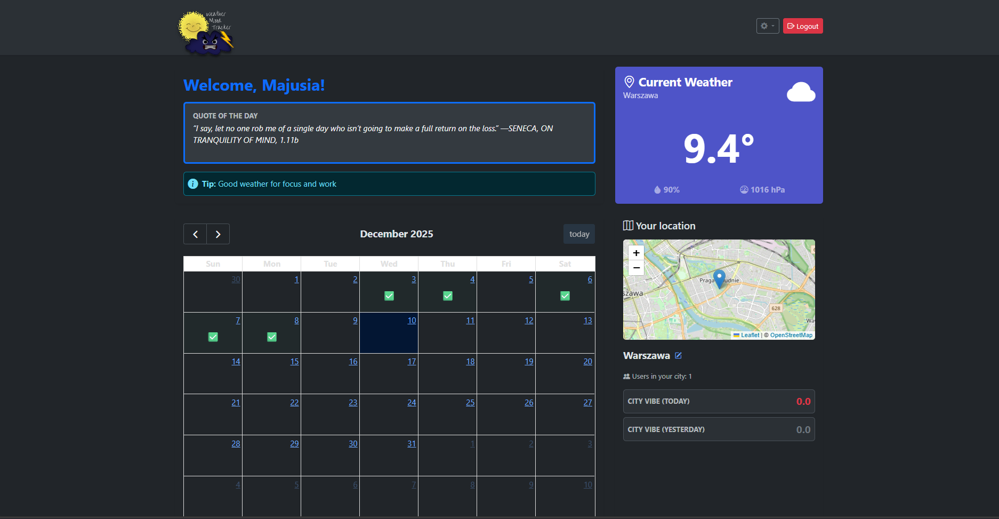
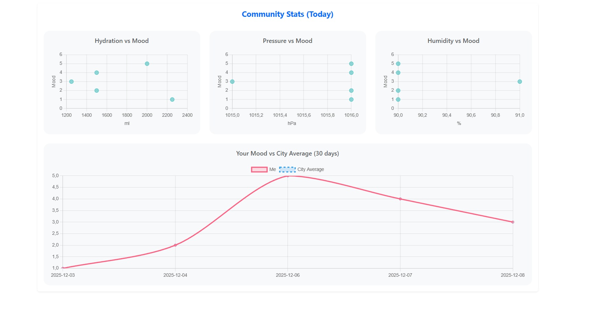
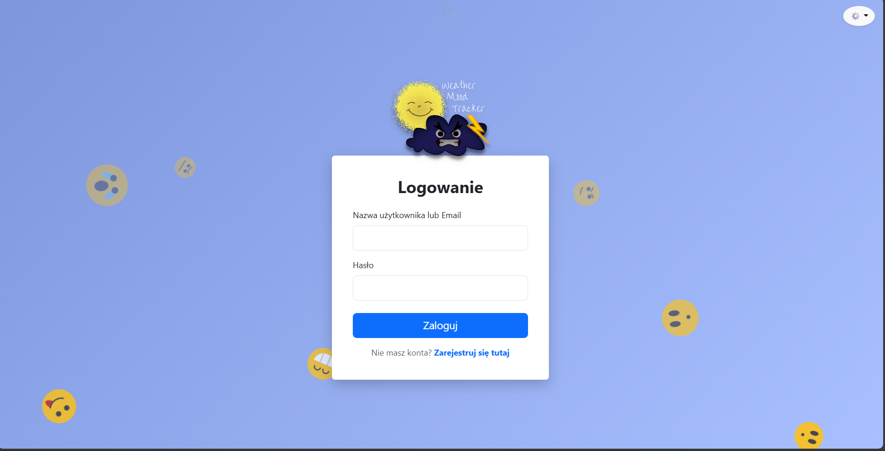

# 🌦️ Weather Mood Tracker

> Inteligentny dziennik nastroju analizujący wpływ pogody na Twoje samopoczucie.


## 📖 O projekcie

**Weather Mood Tracker** to aplikacja webowa typu *wellness*, która pomaga użytkownikom zrozumieć korelacje między ich nastrojem a warunkami atmosferycznymi. System automatycznie pobiera dane pogodowe dla lokalizacji użytkownika w momencie wpisu i zestawia je z oceną samopoczucia, poziomem nawodnienia oraz aktywnością fizyczną.

Aplikacja kładzie duży nacisk na **doświadczenie użytkownika (UX)**, oferując interaktywne wykresy, animacje, tryb ciemny oraz pełną responsywność.

## ✨ Kluczowe funkcjonalności

* **Dziennik:** Zapisywanie nastroju, notatek i tagów aktywności z automatycznym "stemplem pogodowym".
* **API Pogodowe:** Pobieranie w czasie rzeczywistym danych (temp, ciśnienie, wilgotność, typ pogody) z OpenWeatherMap.
* **Nawodnienie:** Wizualny licznik wypitych szklanek wody z animacjami.
* **Analityka:**
    * Wykresy korelacji (np. *Ciśnienie vs Nastrój*).
    * Porównanie nastroju użytkownika ze średnią społeczności w danym mieście.
* **Kalendarz Historii:** Przegląd wpisów w widoku miesięcznym (FullCalendar).
* **Mapa i Geolokalizacja:** Wizualizacja lokalizacji użytkownika na mapie (Leaflet + OSM).
* **Personalizacja:** Obsługa motywów (Light/Dark Mode) oraz wielojęzyczność (PL/EN).
* **Eksport Danych:** Pobieranie historii do formatów JSON i XML.

## 📸 Galeria

### Panel Główny (Dashboard)


### Analiza i Statystyki


### Rejestracja i Logowanie


## 🛠️ Stack Technologiczny

* **Backend:** Java 17, Spring Boot 3 (Web, Data JPA, Security, Validation)
* **Baza Danych:** PostgreSQL
* **Frontend:** Thymeleaf, Bootstrap 5.3, JavaScript (ES6)
* **Wizualizacja:** Chart.js, Leaflet.js, FullCalendar
* **Narzędzia:** Maven, Lombok, Dotenv
* **Zewnętrzne API:** OpenWeatherMap, DailyStoic, Nominatim

## 🚀 Instrukcja Uruchomienia

### 1. Wymagania wstępne
Upewnij się, że masz zainstalowane:
* Java JDK 17+
* Maven
* Baza danych PostgreSQL

### 2. Klonowanie repozytorium
```bash
git clone [https://github.com/twoj-nick/weather-mood-tracker.git](https://github.com/twoj-nick/weather-mood-tracker.git)
cd weather-mood-tracker
```

### 3. Konfiguracja bazy danych
Stwórz pustą bazę danych w PostgreSQL (np. przez pgAdmin lub terminal):

```bash
CREATE DATABASE weather_mood_tracker;
```
### 4. Plik konfiguracyjny .env
W głównym katalogu projektu (tam gdzie jest pom.xml) utwórz plik o nazwie .env i wklej do niego poniższą treść, uzupełniając swoje dane:
```bash
# Konfiguracja Bazy Danych
DB_URL=jdbc:postgresql://localhost:5432/weather_mood_tracker
DB_USERNAME=postgres
DB_PASSWORD=twoje_haslo_do_bazy

# Klucze API
# Zarejestruj się na [https://openweathermap.org/api](https://openweathermap.org/api) aby otrzymać darmowy klucz
OPEN_WEATHER_API_KEY=twoj_klucz_api_openweather
```

### 5. Uruchomienie aplikacji 
Użyj Mavena do zbudowania i uruchomienia projektu:

```bash
mvn spring-boot:run
```

Aplikacja wstanie pod adresem: http://localhost:8080

## 👥 Autorzy

| <a href="https://github.com/evee03"></a> | <a href="https://github.com/WikMat02"></a> | <a href="https://github.com/Neskka"></a> |
|:--------------------------------------------------------------------------------------------------------:|:------------------------------------------------------------------------------------------------------------:|:--------------------------------------------------------------------------------------------------------:|
|                                 [**evee03**](https://github.com/evee03)                                  |                                     [**WikMat02**](https://github.com/)                                      |                                 [**Neskka**](https://github.com/Neskka)                                  |

---
*Projekt zrealizowany przez studentów Informatyki **Politechniki Lubelskiej** w ramach przedmiotu **Zaawansowane programowanie w Javie**, 2025.*
